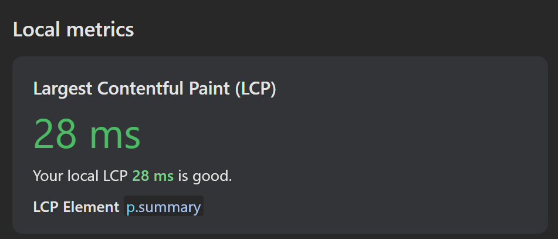
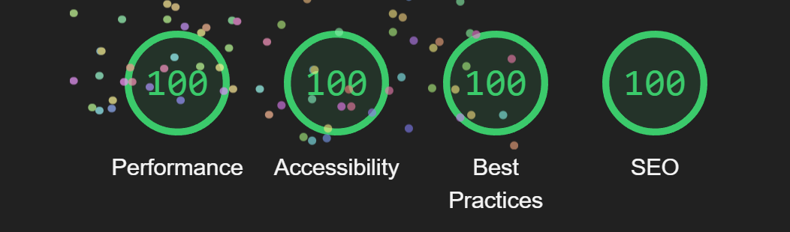
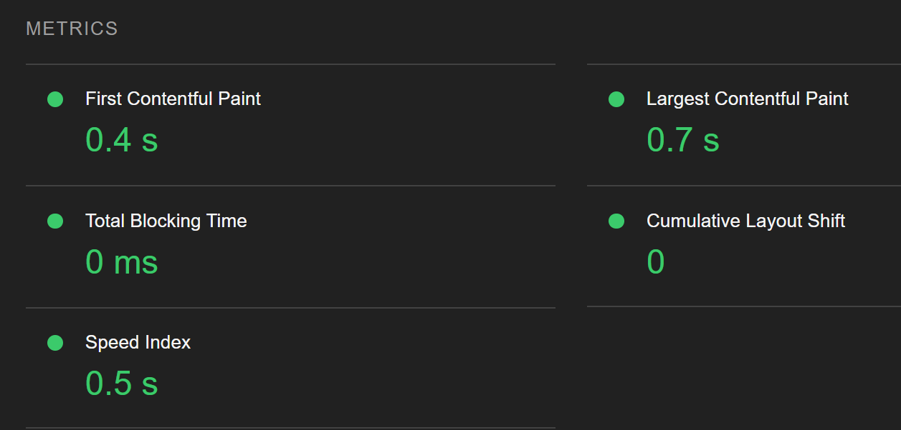
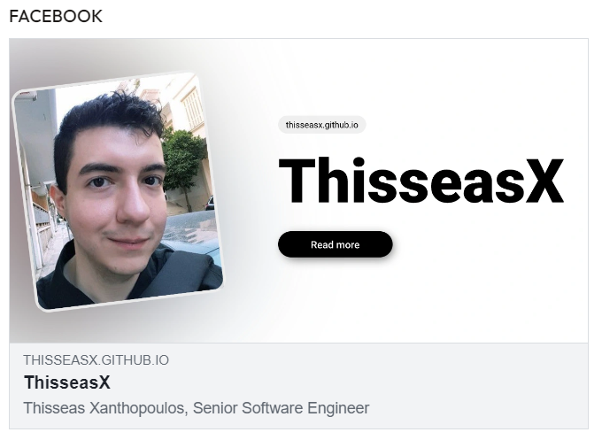

# ThisseasX | Senior Software Engineer

Yes, those badges above are some of the tools I use or teach 🥸.

Please visit [ThisseasX](https://thisseasx.github.io) to view my CV.

## 👨🏻‍💻 Techniques used in this project

Just a sneak peak showcasing some of the things I like:

- [Semantic HTML](https://www.w3schools.com/html/html5_semantic_elements.asp)
- [Motion UI](https://en.wikipedia.org/wiki/Motion_graphic_design)
- [PWA](https://web.dev/explore/progressive-web-apps)
- [SEO](https://en.wikipedia.org/wiki/Search_engine_optimization) | [Open Graph Protocol](https://ogp.me/) tags
- [BEM](https://getbem.com/)
- Custom-coded SVGs (because why not)
- [OpenType variable fonts](https://fonts.google.com/knowledge/introducing_type/introducing_variable_fonts)
- How to avoid [FOIT](https://fonts.google.com/knowledge/glossary/foit) to eliminate [CLS](https://web.dev/articles/cls)
- Optimized [WEBP Images](https://developers.google.com/speed/webp)
- 100% Lighthouse score

> **Note:** Don't forget to click the section headers in the sidebar

> **Also Note:** This CV is a full-fledged PWA, installable on any device, and even works completely offline

## 📊 Funny Metrics

Because why not run a Lighthouse audit on my CV?

## 📱Social Media Preview

Thanks to Open Graph Protocol tags

## 🎲 Other things I enjoy

- [Board Games](https://boardgamegeek.com/user/Thiss)
- [Flesh and Blood](https://fabtcg.com/en)
- Handcrafting high quality [Proxy Cards](https://en.wikipedia.org/wiki/Proxy_card)
- [Origami](https://en.wikipedia.org/wiki/Origami)
- Dreaming of becoming a [Digital Nomad](https://digitalnomads.world)
